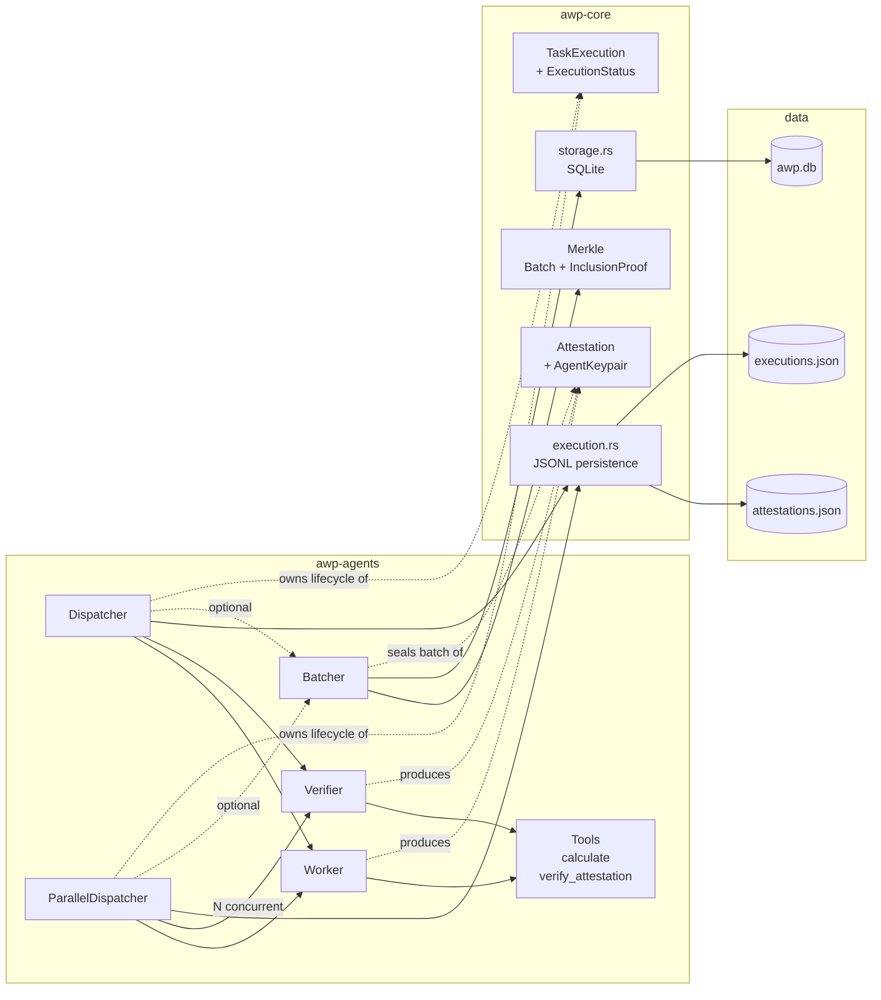
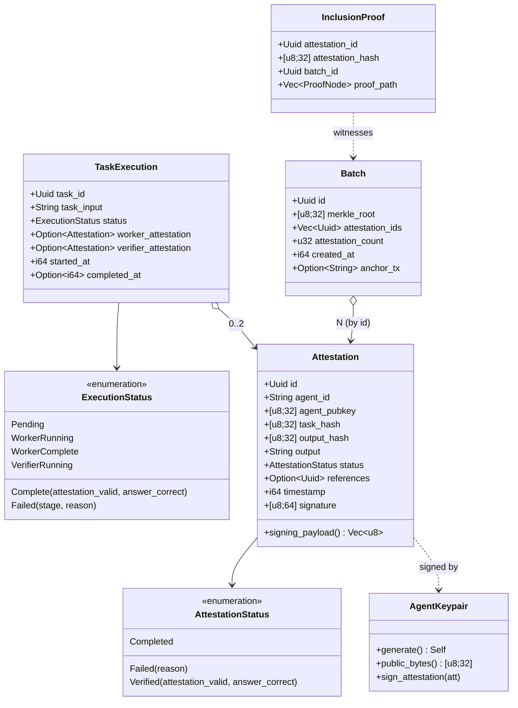
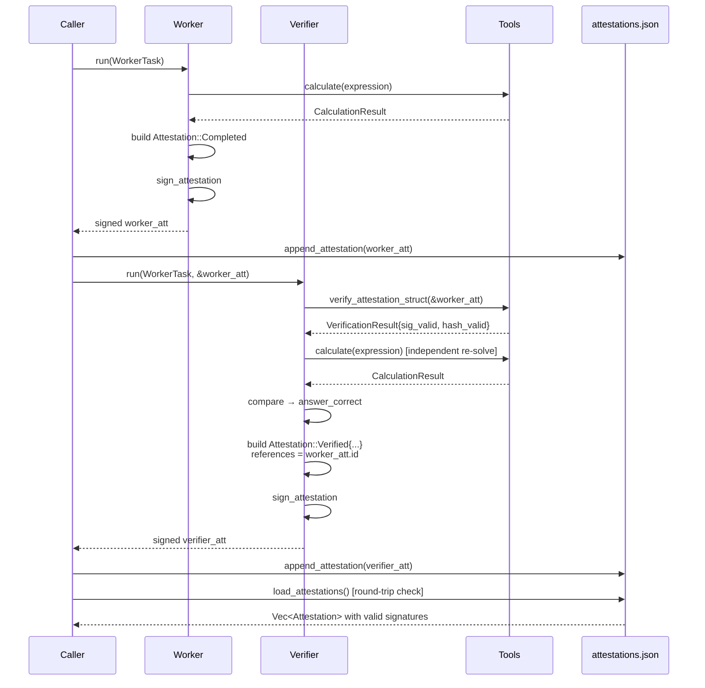
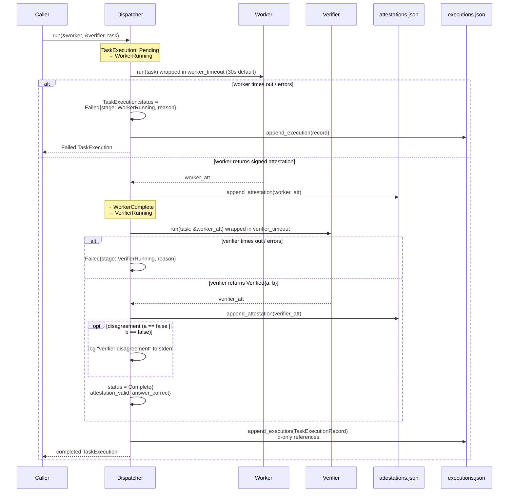
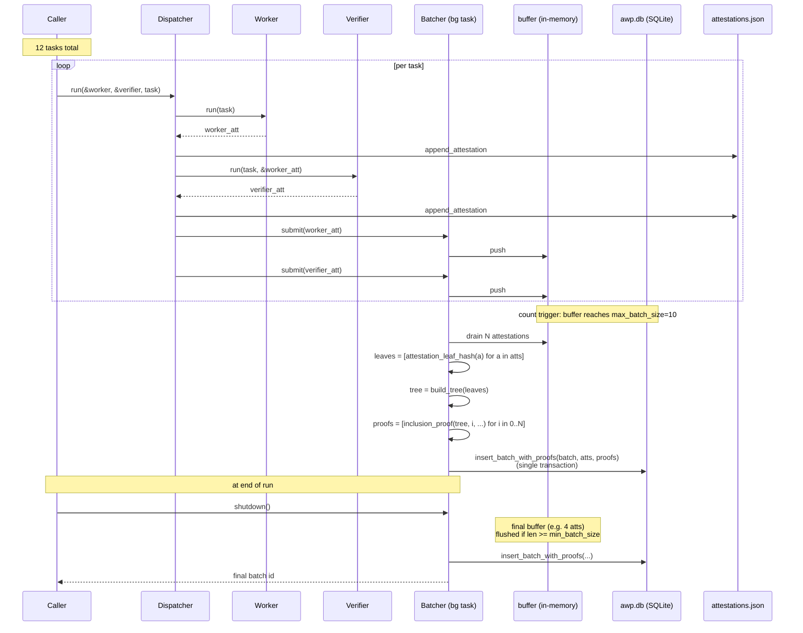
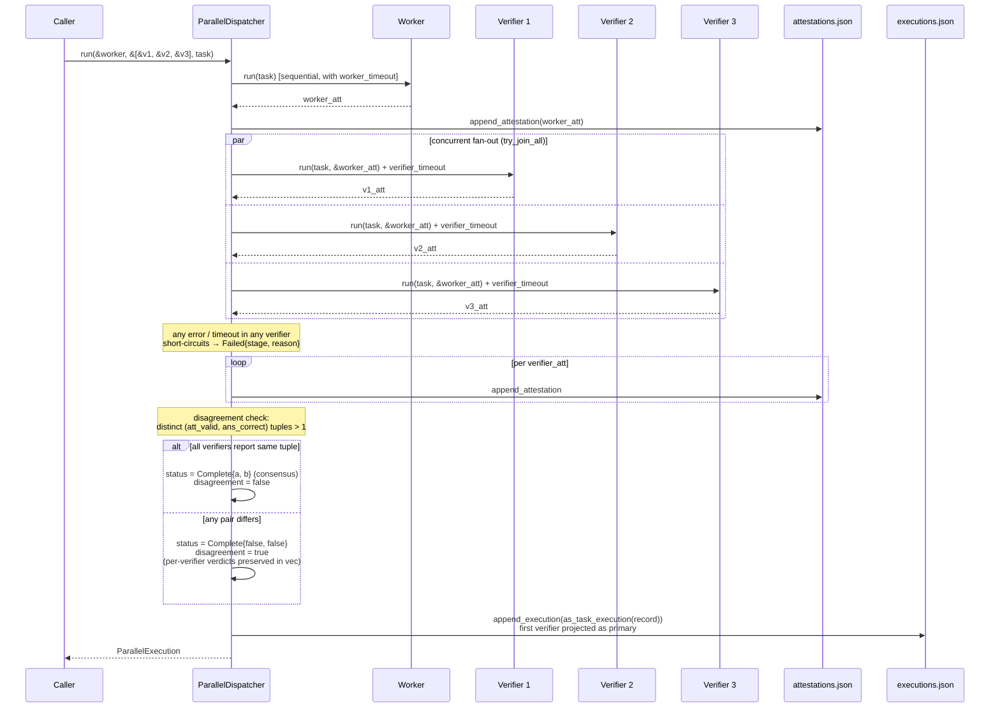
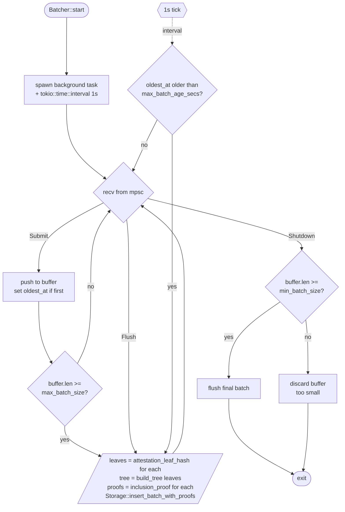

# AWP Prototype Architecture

A description of what is currently shipped in this repository at the close of the 8-week prototype (Phases 1–4 merged to `main`). Diagrams are Mermaid and render inline in GitHub.

This document is descriptive, not prescriptive. For the *why* behind the shape, see [`DECISIONS.md`](DECISIONS.md). For known friction, see [`PAIN_POINTS.md`](PAIN_POINTS.md). For the original plan plus the postmortem, see [`../planning/awp-prototype-plan.md`](../planning/awp-prototype-plan.md).

## Workspace layout

```
awp/
├── crates/
│   ├── awp-core/          # framework-agnostic data + crypto + storage
│   │   ├── attestation.rs # Attestation, AttestationStatus, signing_payload
│   │   ├── signing.rs     # AgentKeypair (ed25519)
│   │   ├── task.rs        # TaskExecution, ExecutionStatus
│   │   ├── execution.rs   # JSONL persistence for executions+attestations
│   │   ├── merkle.rs      # Batch, InclusionProof, attestation_leaf_hash
│   │   └── storage.rs     # SQLite: batches, attestations, proofs
│   ├── awp-agents/        # agent loop + coordination
│   │   ├── worker.rs      # WorkerAgent trait + Worker
│   │   ├── verifier.rs    # VerifierAgent trait + Verifier
│   │   ├── dispatcher.rs  # Dispatcher (single verifier)
│   │   ├── parallel.rs    # ParallelDispatcher (N verifiers)
│   │   ├── batcher.rs     # Batcher (count + time triggered)
│   │   └── tools.rs       # calculate, verify_attestation
│   └── awp-examples/      # shared example helpers
├── examples/
│   ├── simple_attestation.rs
│   ├── dispatcher_flow.rs
│   ├── full_pipeline.rs
│   └── parallel_verifiers.rs
└── data/                  # JSONL logs + SQLite, gitignored
```

`awp-core` has zero dependency on `awp-agents` — the plan's "minimal framework coupling in awp-core" risk-mitigation row was honoured. A future framework swap (see DECISIONS.md) would touch `awp-agents` only.

## High-level architecture



### Module dependency rules

- `awp-core` is leaf. No dependency on agents, tokio runtime, or any framework.
- `awp-agents` depends on `awp-core` only. Tokio enters here.
- `awp-examples` depends on both. The four example binaries live in `examples/` and depend on `awp-examples` for shared helpers.

## Core data model

`Attestation` (in `awp-core`) is the central record. Every Worker run, every Verifier run, and every persisted execution composes from it.



### How attestations are bound

- `signing_payload()` is the canonical bytes of every field except `signature`. Stable across runs.
- `AgentKeypair::sign_attestation(&mut Attestation)` populates `agent_pubkey` and `signature` together — the public key on the wire matches the key that signed.
- `attestation_leaf_hash(&att) = SHA256(signing_payload || signature)`. Tampering with payload *or* signature changes the leaf, which changes the Merkle root, which fails inclusion verification.
- `verify_inclusion(root, attestation_hash, proof) -> bool` requires only those three inputs — the Phase 3 hard exit criterion.

## Coordination flows

The four examples each demonstrate one coordination shape. The swim lanes below show what's actually shipped, not what was planned.

### Flow 1 — Simple attestation (Worker → Verifier, no Dispatcher)

`examples/simple_attestation.rs` wires Worker and Verifier directly. No Dispatcher, no timeouts, no batcher. Used as the Phase 1 checkpoint and as a smoke test for the signing/verification round-trip.



**Storage:** `data/attestations.json` (JSONL, append-only). Two records per run.

### Flow 2 — Dispatcher (single verifier with timeouts and persistence)

`examples/dispatcher_flow.rs` runs three tasks: a happy path, a worker-timeout path, and a verifier-disagreement path. The Dispatcher owns the lifecycle and writes both the attestation log and the execution log.



**Non-obvious behaviour:**

- Verifier disagreement is **logged but not failed**. The Dispatcher transitions to `Complete{false, …}`, not `Failed`. Disagreement is the very signal the system exists to surface.
- Both attestations are persisted to `attestations.json` *before* the execution record is written, so a partial crash leaves attestations intact.
- `TaskExecutionRecord` (the on-disk form) holds attestation **ids** only; `load_execution` rejoins by reading `attestations.json` into a HashMap.

### Flow 3 — Full pipeline (Dispatcher + Batcher → SQLite)

`examples/full_pipeline.rs` runs 12 tasks through a Dispatcher wired to a Batcher with default config (`max_batch_size: 10, max_batch_age_secs: 60, min_batch_size: 1`). At 12 tasks × 2 attestations = 24 submissions, the count trigger fires twice (at 10 and 20) and the shutdown flush seals the remaining 4 — three batches total.



**Verification (asserted by the example):**

```
verify_attestation_inclusion(att_id) → true
  given only:
    - the batch's merkle_root (stored in awp.db)
    - the attestation's stored InclusionProof
    - the attestation itself

tamper(att in awp.db) → leaf_hash changes → verify_attestation_inclusion = false
```

**Storage:** `data/awp.db` is the source of truth for batches, batched attestations, and proofs. `attestations.json` and `executions.json` continue to be appended by the Dispatcher for backwards compatibility — see PAIN_POINTS.md synthesis #4 ("three storage models for one prototype").

### Flow 4 — Parallel verifiers (Worker → N concurrent Verifiers)

`examples/parallel_verifiers.rs` is the Phase 4 stretch task. It runs the same Worker output past three Verifiers concurrently — once with three honest verifiers (unanimous agreement) and once with two honest plus one adversarial (disagreement detected).



**Non-obvious behaviour:**

- **Disagreement is unanimous-check, not majority vote.** If 2 out of 3 say "valid" and 1 says "invalid", `disagreement = true` and the consensus status is `Complete{false, false}`. Downstream majority logic is recoverable from `verifier_attestations: Vec<Attestation>`.
- **Strict failure policy via `try_join_all`.** Any single verifier failure halts the whole stage. Switching to best-effort (use `join_all`, record per-verifier failures inline) is a one-line change but a real product decision left for the human (DECISIONS.md D4.4).
- **`as_task_execution` projects the N-verifier shape to the Phase 2 single-verifier `TaskExecution`** so the existing `executions.json` reader keeps working. The first verifier becomes the "primary"; the full set is recoverable by reading `attestations.json` by id. PAIN_POINTS.md synthesis #3 flags this as the natural place for a Phase-2-of-AWP coordination-type generalisation.

## Batcher trigger logic

The Batcher is the only piece in the system that runs on a clock as well as on events. The two triggers compose; either fires a flush.



**Defaults:** `max_batch_size: 10, max_batch_age_secs: 60, min_batch_size: 1`. With these, anything submitted gets sealed eventually — the only way to lose an attestation is configuring `min_batch_size > 1` and shutting down with a smaller buffer.

**Latency floor:** the age-trigger polls every 1 second, so a quiet single-attestation submission flushes at `max_batch_age_secs + ~1s`. This is the wakeup cost flagged in PAIN_POINTS.md synthesis #5.

## Storage map

| Artifact | Path | Format | Append-only? | Owner |
|----------|------|--------|--------------|-------|
| Worker / Verifier attestations | `data/attestations.json` | JSONL (1 `Attestation` / line) | yes | Dispatcher, ParallelDispatcher, examples |
| Execution records | `data/executions.json` | JSONL (1 `TaskExecutionRecord` / line, id-only) | yes | Dispatcher, ParallelDispatcher |
| Sealed batches | `data/awp.db` table `batches` | SQLite | INSERT only | Batcher |
| Batched attestations | `data/awp.db` table `attestations` | SQLite, `INSERT OR IGNORE` + later UPDATE for `batch_id` | upsert | Batcher |
| Inclusion proofs | `data/awp.db` table `proofs` (1 row per attestation, JSON BLOB `proof_path`) | SQLite | INSERT only | Batcher |

The Batcher's SQLite write is one transaction per flush — batch row, all attestation upserts, and all proof rows commit together or not at all.

The Phase 1/2 JSONL logs and the Phase 3 SQLite database overlap intentionally during the prototype: the JSONL logs are the durable record of *every* execution, while SQLite is the authoritative store for the *batched* subset. PAIN_POINTS.md synthesis #4 flags this as untenable for production; collapsing to one model is a Phase-2-of-AWP task.

## Tools

Two tools live in `awp-agents/src/tools.rs`:

- **`calculate(expression: &str) -> Result<CalculationResult>`** — recursive-descent parser supporting `+ - * /`, parentheses, and unary minus. Used by both Worker (to produce an answer) and Verifier (to independently re-solve).
- **`verify_attestation`** ships in two forms:
  - `verify_attestation(json: &str) -> Result<VerificationResult>` — JSON-string surface for an LLM-driven tool runtime
  - `verify_attestation_struct(att: &Attestation) -> VerificationResult` — typed in-process surface used by the Verifier

The dual surface is PAIN_POINTS.md synthesis #2 — currently ~5 lines of glue, but every typed value would need a serialised twin if every tool also exposed a JSON face. The recommendation in DECISIONS.md (Option C — thin custom layer on Rig) collapses this duplication by owning the agent loop and using JSON only at the LLM boundary.

## What is *not* implemented

These appear in the planning docs but are **explicitly deferred** and not present in the current code:

- **AutoAgents framework integration.** Worker and Verifier are plain async types; the framework named "primary" in the plan has zero lines of code in the implementation (DECISIONS.md D1.1, PAIN_POINTS.md synthesis #1).
- **On-chain anchoring.** `Batch.anchor_tx` and `Batch.anchor_chain` exist but are always `None` / `NULL`. No chain client.
- **Persistent agent identity.** `AgentKeypair::generate()` is called per Worker/Verifier construction. No on-disk identity, no key rotation, no operator linkage.
- **HTTP / external API.** The prototype is a CLI / library only.
- **LuaI execution layer (Appendix A of the plan).** No `trace_hash`, no `zk_proof`, no Lua runtime.

## See also

- [`PHASE1_REVIEW.md`](PHASE1_REVIEW.md) — synthesised executive summary of Phase 1's outcome
- [`DECISIONS.md`](DECISIONS.md) — design decisions log + framework recommendation
- [`PAIN_POINTS.md`](PAIN_POINTS.md) — friction log + Phase 4 synthesis
- [`../planning/awp-prototype-plan.md`](../planning/awp-prototype-plan.md) — original 8-week plan + Phase 1 Postmortem
