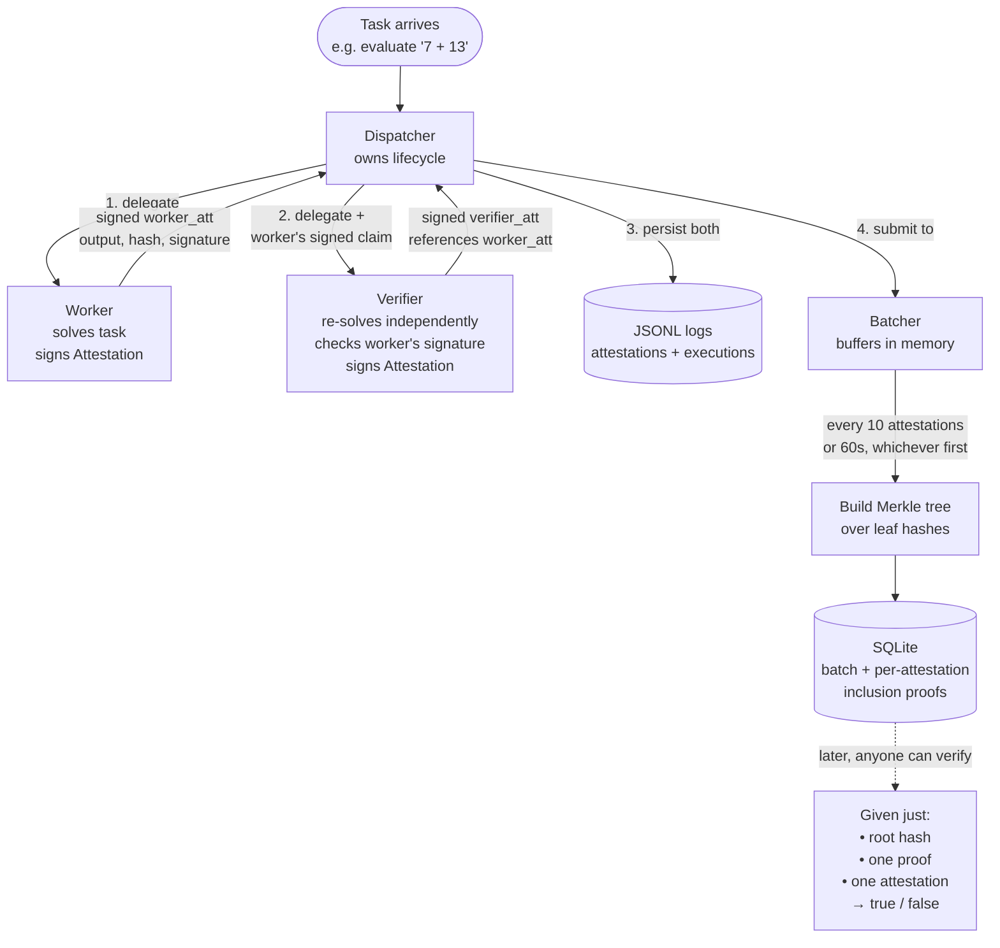

# AWP Process Overview

A high-level walkthrough of how the AWP prototype works end-to-end. Companion to [`ARCHITECTURE.md`](ARCHITECTURE.md), which goes deeper into modules, types, and per-example swim lanes — read this first.

## The 30-second version

Tasks come in → a Worker solves them and signs an attestation → a Verifier independently re-solves and signs its own attestation referencing the Worker's → a Dispatcher coordinates this and persists both → a Batcher periodically gathers attestations into Merkle trees so anyone can later prove inclusion against a small root hash.

## The flow

## The four moving parts

| Piece | Job | Output |
|---|---|---|
| **Worker** | Do the task. Sign a record of what it did. | `Attestation{ status: Completed }` (or `Failed`) |
| **Verifier** | Independently redo the task. Check the Worker's signature and answer. | `Attestation{ status: Verified { attestation_valid, answer_correct } }` referencing the Worker's |
| **Dispatcher** | Sequence Worker → Verifier with timeouts. Persist everything. Surface disagreement as data, not as failure. | `TaskExecution` record |
| **Batcher** | Group many attestations into Merkle trees. Generate inclusion proofs. | `Batch` row + N proofs in SQLite |

## What each step actually proves

- **Worker's signature** — "this specific agent claims this specific output for this specific task at this specific time." The signature is over a SHA-256 hash of all those fields, so tampering with any of them invalidates the signature.
- **Verifier's signature on a `Verified` status** — "I, a different agent, independently checked the Worker's crypto and re-solved the task. Here are my two verdicts as separate booleans." The two verdicts are independent: an attestation can be cryptographically valid but produce the wrong answer, or the answer can match but the signature was forged.
- **Merkle root + inclusion proof** — "this attestation was part of this batch." A 1000-attestation batch is summarised by a single 32-byte root; proving any one attestation belongs to it costs ~10 hashes. This is what makes on-chain anchoring practical (deferred to Phase 2-of-AWP) — you'd anchor one root per batch, not one transaction per attestation.

## The two coordination shapes that ship

- **Sequential** (default `Dispatcher`) — one Worker, one Verifier, in order. Used by `dispatcher_flow.rs` and `full_pipeline.rs`.
- **Fan-out** (`ParallelDispatcher`) — one Worker, N Verifiers running concurrently. Disagreement (any pair of Verifiers reaching different verdicts) is detected and flagged, but per-Verifier verdicts are preserved so downstream code can apply majority logic if it wants. Used by `parallel_verifiers.rs`.

## What's *not* in the loop

Three deliberate, scope-deferred gaps and one emergent framework gap.

### Deliberate scope deferrals

- **No LLM is called.** The Worker uses a built-in `calculate` tool (a recursive-descent arithmetic parser) so the system is hermetic and runs in CI without API keys.
- **No blockchain.** `Batch.anchor_tx` exists as a column but is always `NULL`; on-chain anchoring is Phase 2-of-AWP.
- **No persistent agent identity.** Each Worker/Verifier generates a fresh ed25519 keypair on construction. Persistence and key rotation are deferred.

### Emergent gap surfaced by Phase 4

- **AutoAgents — the framework named "primary" in the plan — has zero lines of code in the implementation.** Worker and Verifier ship as plain async traits because `AgentBuilder.run()` requires a live LLM provider, which collides with the "no LLM" gap above. This was not a planned deferral; it surfaced during Phase 1's framework-integration scan and was never closed. See [`PAIN_POINTS.md`](PAIN_POINTS.md) synthesis #1 and [`DECISIONS.md`](DECISIONS.md) D1.1.

### Why it matters that it's four, not three

The LLM and framework gaps are coupled. The day someone wants to close the LLM gap (a real model in the loop), they hit the framework gap (which agent runtime drives that loop?). [`DECISIONS.md`](DECISIONS.md)'s Option-C-on-Rig recommendation is built on that coupling: defer the framework choice until LLM integration is the next-task, then commit.

The blockchain and identity gaps are independent and can be closed in either order without touching the agent loop.

That's the whole prototype. Everything else in [`ARCHITECTURE.md`](ARCHITECTURE.md) is detail on these five blocks: Worker, Verifier, Dispatcher (or ParallelDispatcher), Batcher, and the storage they share.

## See also

- [`ARCHITECTURE.md`](ARCHITECTURE.md) — full architecture: modules, types, per-example swim lanes, batcher trigger logic, storage map
- [`USER_JOURNEYS.md`](USER_JOURNEYS.md) — buyer-persona journeys + GTM-driven next-step ordering
- [`PHASE1_REVIEW.md`](PHASE1_REVIEW.md) — Phase 1 outcome and recommended next move
- [`DECISIONS.md`](DECISIONS.md) — design decisions log + framework recommendation
- [`PAIN_POINTS.md`](PAIN_POINTS.md) — friction log + Phase 4 synthesis
