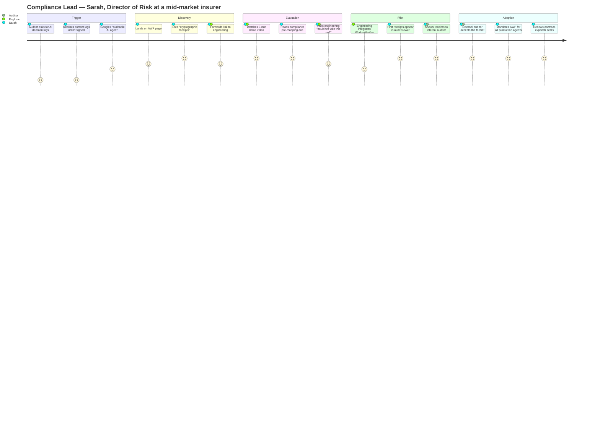
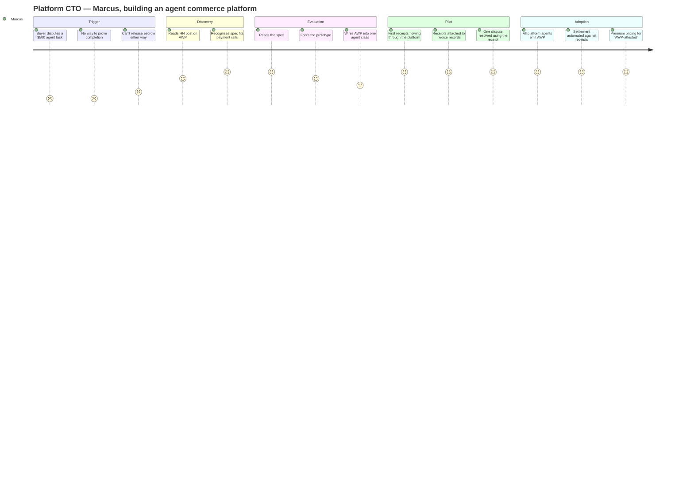
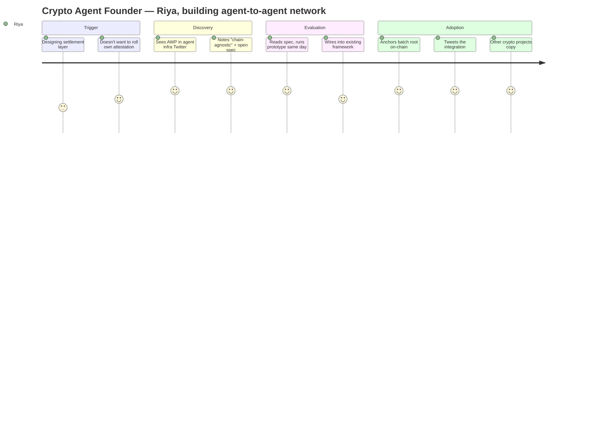
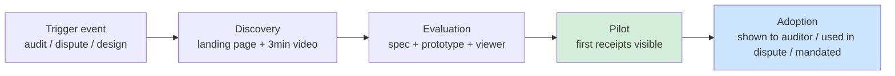

# User Journeys

How real users would adopt AWP, mapped against the three buyer personas from [`../awp-market-research.md`](../awp-market-research.md). Companion to [`PROCESS_OVERVIEW.md`](PROCESS_OVERVIEW.md) (what the system does) and [`ARCHITECTURE.md`](ARCHITECTURE.md) (how it does it). This document answers *who is using it and what does that look like end-to-end*.

The three journeys are deliberately different. The same prototype + viewer + spec serves all three, but the **decisive pilot moment** is different for each, and that drives what we build next.

## Three users, three journeys

### Persona A — Compliance Lead at a regulated mid-market firm

The primary ICP per the GTM (§2.1, §4.1). Sarah doesn't write agent code; she owns audit-readiness for the AI deployment.

**Decisive moment:** "first receipts appear in audit viewer." Sarah does not read JSONL. She needs to *see* a row that says *"Customer #4711 — KYC decision APPROVED — verified by Verifier-2 — 2026-05-07 14:32 UTC — receipt #abc123"* and click into the signed proof. This is what motivates the audit viewer in the demo plan.

### Persona B — Agent Platform Operator

Building an agent marketplace; needs verifiable completion to enable settlement.

**Decisive moment:** "one dispute resolved using the receipt." This is the GTM's billing / dispute-resolution wedge made concrete. Marcus's journey foregrounds the *output* (receipt → invoice → resolution), not the cryptography.

### Persona C — Crypto-Native Agent Founder

Already wants on-chain settlement; wants AWP for the attestation primitive.

Riya is fast, free, and useful for distribution — but per GTM §2.1 she is not the revenue path. Her journey does not need optimising; it will happen naturally if the spec and prototype are good. Both already are.

## What the three journeys agree on

The **pilot stage is the make-or-break point** in all three journeys. Specifically: *"first receipts visible in a way the buyer's stakeholder finds legible."*

- Sarah's stakeholder is an auditor → "legible" = timeline view with receipt detail
- Marcus's stakeholder is a finance team → "legible" = receipts attached to invoices
- Riya's stakeholder is herself → "legible" = JSON over RPC

Today's prototype serves Riya well (JSON, signatures, prove-it-yourself). It serves Marcus with glue. It does **not** serve Sarah at all — there is no audit viewer.

## Where the prototype's gaps bite each journey

Mapping back to the four gaps in [`PROCESS_OVERVIEW.md`](PROCESS_OVERVIEW.md):

| Journey stage | Gap that bites | Severity |
|---|---|---|
| Discovery → Evaluation (all) | None — spec is public, prototype works | — |
| Evaluation → Pilot (Sarah) | **No audit viewer.** Receipts exist only as JSONL / SQLite. | High |
| Evaluation → Pilot (Marcus) | **No persistent identity.** Restart = new agent. Not credible for a settlement system. | High |
| Pilot → Adoption (Sarah) | ✓ SR 11-7 ([`compliance/SR_11_7.md`](compliance/SR_11_7.md)) — additional regulations TBD | Resolved (partial) |
| Pilot → Adoption (Marcus) | **No SDK in Python / TypeScript.** Rust core stays reference; Marcus's platform is probably Node. | Medium |
| Pilot → Adoption (Riya) | **No on-chain anchoring.** | Low (workaround: she anchors herself) |

The most important reframing: **persistent identity (gap #3 in PROCESS_OVERVIEW.md) is no longer just a "deferred" item — it is load-bearing for Persona B's pilot stage.** Marcus's settlement system cannot use receipts whose signing keys vanish on restart.

This changes the priority calculus. Closing the identity gap is more valuable than closing on-chain anchoring for the next-six-months GTM goal, even though both were grouped together as "Phase 2-of-AWP" in the prototype plan.

## What this implies for the demo

The two artefacts proposed for GTM Month 2 (3-minute launch video) directly address the three journeys' shared pilot stage:

- **CLI receipts demo** (vertical-flavoured, e.g. KYC) — the engineer's onboarding path. Marcus and Riya use this directly; Sarah's engineer uses it on her behalf.
- **Static HTML audit viewer** — Sarah's pilot moment. Reads `attestations.json` + `executions.json` and renders a timeline with green/red verification badges. This is also what makes the silent demo video work for any persona — signatures verifying without anyone reading hex.

If only one ships first, **ship the viewer**. The CLI is already implicit in the existing examples (`full_pipeline`, `parallel_verifiers`); the viewer is the gap.

## GTM-driven next-step ordering

If the goal is GTM Month 2 demo video → Month 3 design partner, the user-journey analysis points at this ordering — which is *different* from "continue the prototype plan":

1. **Build the audit viewer** — unlocks Sarah's pilot moment; makes the demo video work for everyone.
2. **Build a vertical receipts demo** (KYC or claims-processing flavour) — gives the viewer something legible to render.
3. **Close the persistent-identity gap** — unblocks Marcus's pilot. Cheapest of the four gaps to close (~100 LOC for a disk-backed keypair store).
4. **Write one compliance pre-mapping doc** — pick SR 11-7 (densest fintech payoff per GTM §4.2). Even a draft pays off in Persona A conversations.
5. **Defer on-chain anchoring** indefinitely until a Persona C deal explicitly asks for it.

This is product / GTM work, not protocol work. Phases 1–4 of the prototype are done; the next move serves users, not the spec.

## See also

- [`../planning/gtm-phase-1-plan.md`](../planning/gtm-phase-1-plan.md) — the four-step plan that operationalises this journey analysis
- [`../planning/gtm-phase-1-agent-prompts.md`](../planning/gtm-phase-1-agent-prompts.md) — dispatch prompts for the four steps
- [`../awp-market-research.md`](../awp-market-research.md) — buyer personas, GTM plan, defensibility levers
- [`PROCESS_OVERVIEW.md`](PROCESS_OVERVIEW.md) — system overview + the four gaps
- [`ARCHITECTURE.md`](ARCHITECTURE.md) — full architecture
- [`PHASE1_REVIEW.md`](PHASE1_REVIEW.md) — Phase 1 outcome and the (now superseded) prototype-plan-driven next move
- [`DECISIONS.md`](DECISIONS.md) — design decisions + framework recommendation
